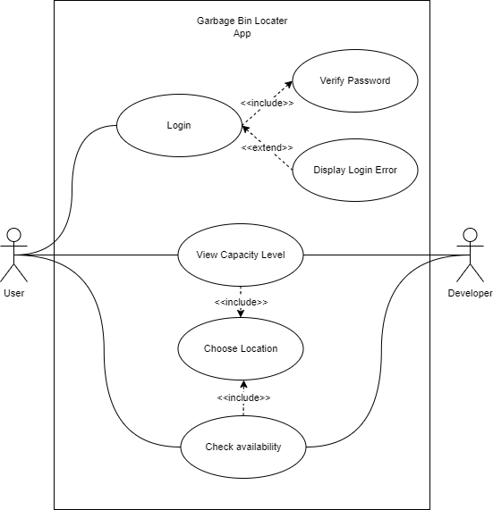
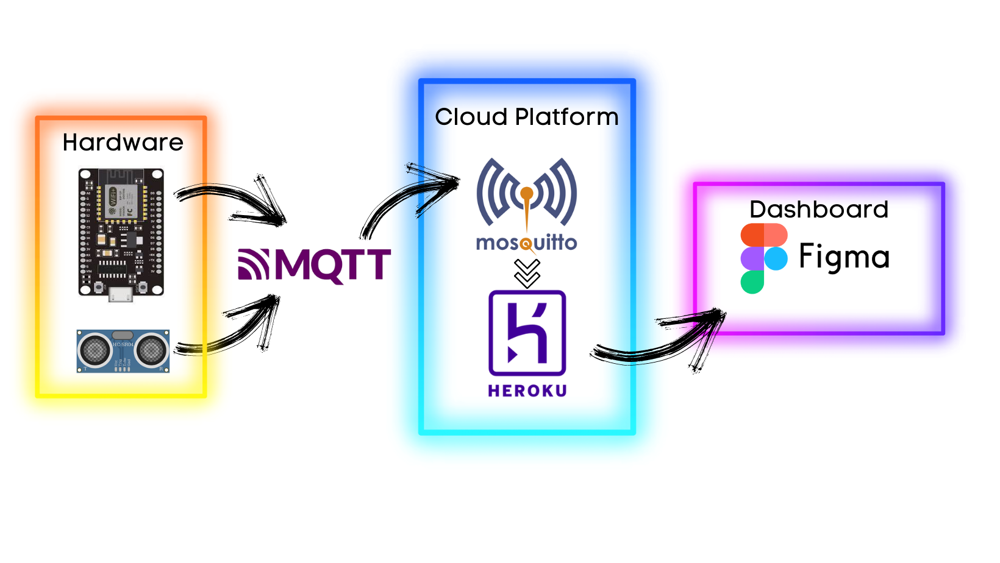
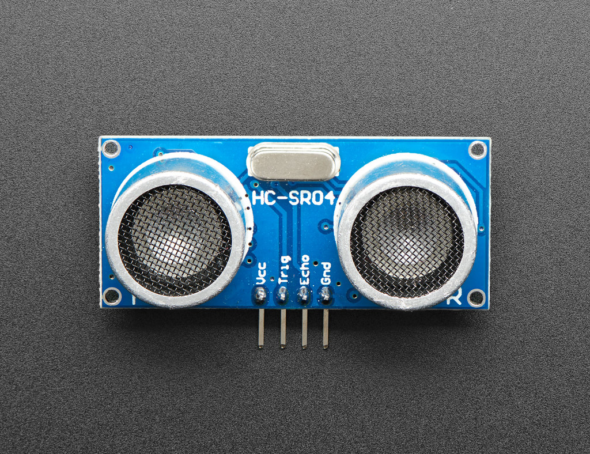
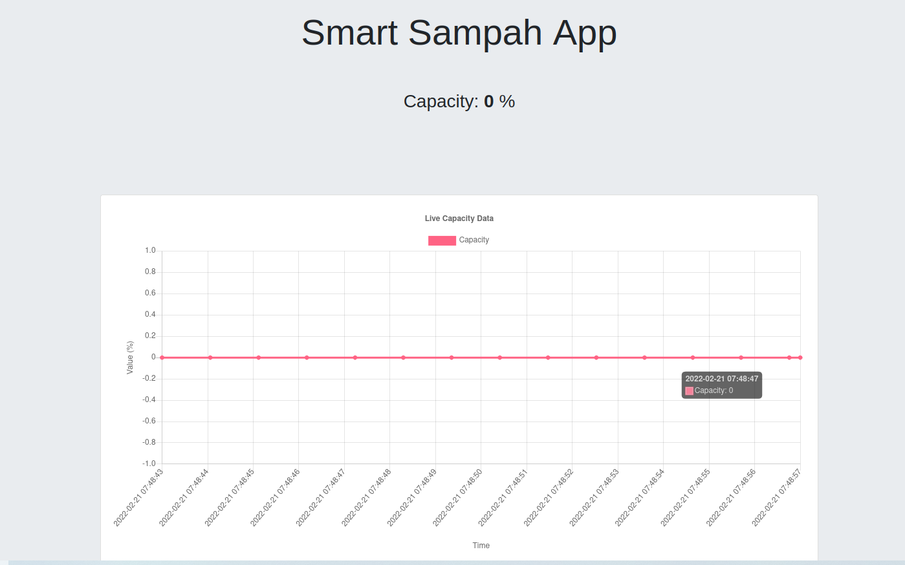
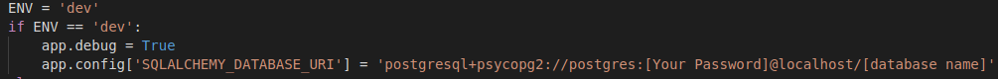

# IoTproject
An IoT project for SKEL 4213 on waste management system using ESP 8266 with HC-SR04 ultrasonic sensor to obtain the required data.
## IoT Waste Management System 🗑️ 
### Problem Statement

*The availability of garbage bins spaces are always unavailable during the weekend at the college. This is beacuse of the cleaners are not working during the weekends and this leads to accumulated of rubbish that are not collected. Because of this, the residents do not know where to throw their rubbish and end up leaving it outside of the overflowing rubbish bin.* 

<strong><ins>Our Solution</ins></strong>

An IoT application to automate the manual checking rubbish bins that is already full or not, and pass the information to a dashboard where users could locate any available bins that are available.

<strong><ins>Use Case Diagram</ins></strong>

<p align="center">

</p>

### System Architecture

Below are the general overview of the system architecture for our IoT waste management system. For this project we will be using **ESP 8266** as our microcontroller device and it will be connected to **HC-SR04** ultrasonic sensor to obtain the capacity level of rubbish bins. The device will communicate using **HTTP** data protocol transmission and it will send the data to a **REST-API** implemented in **Flask** before later on hosted by **Heroku** Cloud platform and finally display the data on our simple dashboard app which we will be build using **Figma**. 



### Hardware
<strong><ins>ESP 8266</ins></strong>


<strong><ins>HC-SR04</ins></strong>



<strong><ins>Circuit Diagram</ins></strong>


<strong>Code Sample</strong>

<details>
  <summary>Please Click Me</summary>

  ```
//define sound velocity in cm/uS
#define SOUND_VELOCITY 0.034


long duration;
float distanceCm;

const int trigPin = 12;
const int echoPin = 14;

void setup() {
  Serial.begin(115200); // Starts the serial communication
  pinMode(trigPin, OUTPUT); // Sets the trigPin as an Output
  pinMode(echoPin, INPUT); // Sets the echoPin as an Input
}

void loop() {
  // Clears the trigPin
  digitalWrite(trigPin, LOW);
  delayMicroseconds(2);
  // Sets the trigPin on HIGH state for 10 micro seconds
  digitalWrite(trigPin, HIGH);
  delayMicroseconds(10);
  digitalWrite(trigPin, LOW);
  
  // Reads the echoPin, returns the sound wave travel time in microseconds
  duration = pulseIn(echoPin, HIGH);
  
  // Calculate the distance
  distanceCm = (duration * SOUND_VELOCITY/2)-1;
  
  // Prints the distance on the Serial Monitor
  Serial.print("Distance (cm): ");
  Serial.println(distanceCm);

  delay(1000);
}
  ```
</details>


### Cloud Platform

The following [video](https://youtu.be/mI5fn9AS04o) shows the process on how to deploy an application using Heroku. This is the [link](https://iot-waste-v2.herokuapp.com/) to the website in the video.
 
### Dashboard

<p align="center">





</p>


## MILESTONE 3

The following [video](https://youtu.be/7Tu39UT9mWg) shows the process on how we send data from our device to our web server using http protocol. This is the [link](https://sampah-app.herokuapp.com/) to the our web server hosted by Heroku as shown in the video.

## MILESTONE 4

The following [video](https://youtu.be/742bh3Lgsps) shows the process on how we save the data from our IoT device to a dashboard and visualize the data on a dashboard. The database that we used for our porject is PostgreSQL due to its simplicity to deploy with  heroku. Grafana was used for the visualization of the data in the database as shown in the video. 

## MILESTONE 5

The following [video](https://youtu.be/rmHrgsxgMzo) shows the explanation in detail about milestone 5 which is the UI Improvement. The layout of the improve UI has being change slightly appopriate to the comments of the app user. The changes includes a time-series graph and more sophisicated real-time data refresh. The user comments are as below:

- app too simple and bland
- need to know specific time the rubbish can is full
- the app keeps refreshing making it too buggy

## Steps on clonning the project

1. Git clone the repository to your desired location in your local machine.
2. Open the cloned repo with any IDE (e.g. VS Code) or can use terminal but make sure the cloned file is in the same path you are in at the moment.
3. Execute the codes below for making a new virtual environment and install all the required dependecies. 

 ```
  pipenv shell
  pipenv install requirements.txt
```
4. After done execute the above lines inside the terminal, the application are ready to be deploy with Heroku. Before deploy, you can test with your local machine.
5. Before testing with local machine, make sure to install PostgreSQL in local machine which can be found in this [link](https://www.postgresqltutorial.com/install-postgresql-linux/)

6. Once done installing, need to change [Your Password] and [database name] as shown in figure below based on your own credentials. 


7. After done changing it accordingly, you can now test the application with your IoT device with the line below.

```
  python main.py

  or

  flask run
```
<strong>Arduino code for the Project</strong>

<details>
  <summary>Please Click Me</summary>

  ```
#include <ESP8266WiFi.h>
#include <ESP8266HTTPClient.h>
#include <string>

const int trigPin = 14;
const int echoPin = 12;
uint8 capLevel;
int tank_h =50;

//define sound velocity in cm/uS
#define SOUND_VELOCITY 0.034


long duration;
float distanceCm;

const char* ssid = "wifi name";
const char* password = "wifi password";
 
void setup_wifi() {
  WiFi.begin(ssid, password);
  while (WiFi.status() != WL_CONNECTED)
  {
    delay(1000);
    Serial.println("Connecting...");
  }
 
  Serial.println("Connected successfully.");
}

void setup() {
  Serial.begin(115200); // Starts the serial communication
  pinMode(trigPin, OUTPUT); // Sets the trigPin as an Output
  pinMode(echoPin, INPUT); // Sets the echoPin as an Input
  setup_wifi();
}

void loop() {
  // Clears the trigPin
  digitalWrite(trigPin, LOW);
  delayMicroseconds(2);
  // Sets the trigPin on HIGH state for 10 micro seconds
  digitalWrite(trigPin, HIGH);
  delayMicroseconds(10);
  digitalWrite(trigPin, LOW);
  
  // Reads the echoPin, returns the sound wave travel time in microseconds
  duration = pulseIn(echoPin, HIGH);
  
  // Calculate the distance
  distanceCm = duration * SOUND_VELOCITY/2;
  capLevel = 100 - round((distanceCm/tank_h)*100);

  
  // Prints the distance on the Serial Monitor
  Serial.print("Capacity: ");
  Serial.print(capLevel);
  Serial.println("%");

  if (WiFi.status() != WL_CONNECTED) {
    setup_wifi();
  } else {
    //WiFiClient client;
    HTTPClient http;
 
    http.begin("http://smart-sampah.herokuapp.com/log_Data"); ///change accordingly either heroku or localhost
    http.addHeader("Content-Type", "application/x-www-form-urlencoded");
    String requestData = "capacity=" + String(capLevel) + "&count=" + String(true);
    int httpCode = http.POST(requestData); //Send the request
    String payload = http.getString(); //Get the response payload
    Serial.println(httpCode); //Print HTTP return code
    http.end(); //Close connection
  }
  
  delay(10000);
}
  ```
</details>

8. To deploy the app with heroku, need to run the codes below first inside terminal until you get the database URI hosted by Heroku.

```
  sudo snap install --classic heroku
  git init
  heroku login
  heroku create smart-sampah
  heroku addons:create heroku-postgresql:hobby-dev --app smart-sampah
  heroku config --app smart-sampah
```
9. Once got the database URI, copy it and change the database URI in main.py and don't forget to change ENV from dev to prod. 

10. After that run few codes below to deploy the app
```
  git add .
  git commit -m 'Inital Deploy'
  heroku git:remote -a smart-sampah
  git push heroku master
```
